# Declaration

This manuscript reports the analysis implemented in the accompanying repository. Before formal submission, the candidate should replace this paragraph with the declaration required by the awarding institution, including the permitted use of software and AI-assisted tools, authorship responsibility and any prior dissemination of the work.

# Acknowledgements

*[Insert acknowledgements required for the submitted thesis. The present data-only analysis does not infer contributions, funding, ethics approvals or laboratory roles that are absent from the supplied records.]*

# Abstract

High-dimensional proteomics can identify molecular differences between tumour and comparison tissue, but small cohorts, missing measurements, correlated proteins, incomplete laboratory metadata and information leakage create a substantial risk of irreproducible results. This thesis presents a from-scratch, data-only analysis of a supplied oral-cancer tissue proteomics matrix containing 84 specimens from 42 patients, each represented by a tumour and matched non-tumour specimen. The work integrates auditable data engineering, missingness-aware quality control, paired statistical inference, pathway analysis, patient-level heterogeneity assessment, leakage-controlled machine learning, multiverse sensitivity analysis and a locked prospective validation hand-off. Empirical analyses use only the supplied workbook. Research published by 31 December 2023 is used to justify methods but not to invent missing patient, laboratory or clinical information.

The workbook contains 8,071 supplied feature rows, 437,584 positive finite observations and 240,380 blank cells, corresponding to 35.456% missingness. All 42 patient pairs are structurally complete, although only 1,350 feature rows are quantitatively complete across every pair. Quality control identified strong coupling between detection coverage and observed abundance, a broad tumour-associated multivariate structure, and seven patient pairs requiring sensitivity analysis rather than deletion. The primary no-imputation paired analysis identified 614 stable abundance candidates and 1,827 stable detection-pattern candidates under frozen effect, multiplicity and sensitivity rules. Reactome release 86 analysis found 271 pathways supported by both ranked enrichment and patient-level paired scoring. Positive tumour-associated organisation included RNA processing, translation and immune/antigen-handling sets; negative organisation included mitochondrial energy metabolism, extracellular-matrix degradation, complement and haemostasis. Consensus clustering did not support stable patient subtypes.

Nine predictive pipelines were evaluated using 25 repeated patient-grouped nested validations. The leading abundance elastic-net model achieved median ROC AUC 0.982, although a fold-local PCA baseline achieved 0.969 and the tuned elastic nets remained dense, preventing a compact-panel claim. A complete paired-label permutation pipeline produced an empirical p-value of 0.00498. Phase 6 stress testing evaluated 24 prespecified inferential scenarios and 42 exact leave-one-patient-out refits. Of the Phase 3 candidates, 583/614 abundance candidates and 1,804/1,827 detection candidates retained core support in at least 80% of patient omissions; 596/783 Reactome pathways met joint direction and leading-edge robustness criteria. Frozen integration produced 165 high-priority internal candidates. Phase 7 converted these into a prospective, redundancy-aware hand-off of 12 abundance anchors and eight detection sentinels using branch-specific Pareto fronts and paired-change correlation components.

The principal conclusion is deliberately limited: the supplied paired-tissue matrix contains a strong and internally reproducible tumour-versus-matched-non-tumour signal across inferential, pathway and predictive analyses. It does not establish an externally validated biomarker, clinical diagnostic panel, causal mechanism, screening performance or clinical utility. The Phase 2 preprocessing benchmark remains unimplemented, and no independent cohort or orthogonal assay is available. These gaps are preserved as open dependencies rather than filled by unsupported assumptions.

**Keywords:** oral cancer; proteomics; paired design; missing data; empirical Bayes; pathway enrichment; elastic net; nested cross-validation; multiverse analysis; biomarker discovery; reproducibility.

# Table of contents

1. [Introduction](#1-introduction)
2. [Research aims and questions](#2-research-aims-and-questions)
3. [Study material and governing principles](#3-study-material-and-governing-principles)
4. [Computational and statistical methods](#4-computational-and-statistical-methods)
5. [Results](#5-results)
6. [Integrated discussion](#6-integrated-discussion)
7. [Assumptions, limitations and prohibited claims](#7-assumptions-limitations-and-prohibited-claims)
8. [European and translational alignment](#8-european-and-translational-alignment)
9. [Reproducibility, software and auditability](#9-reproducibility-software-and-auditability)
10. [Conclusions and future work](#10-conclusions-and-future-work)
11. [References](#11-references)
12. [Appendices](#12-appendices)

# Abbreviations

| Abbreviation | Meaning |
| --- | --- |
| AI | Artificial intelligence |
| AUC | Area under the receiver-operating-characteristic curve |
| BH | Benjamini–Hochberg |
| BRISQ | Biospecimen Reporting for Improved Study Quality |
| DIA | Data-independent acquisition |
| FDR | False discovery rate |
| GSEA | Gene set enrichment analysis |
| IVDR | European Union In Vitro Diagnostic Medical Devices Regulation |
| LOPO | Leave one patient out |
| MAD | Median absolute deviation |
| MIAPE | Minimum Information About a Proteomics Experiment |
| ML | Machine learning |
| NES | Normalised enrichment score |
| PAC | Proportion of ambiguous clustering |
| PCA | Principal-component analysis |
| PROBAST | Prediction model Risk Of Bias ASsessment Tool |
| QC | Quality control |
| SVM | Support-vector machine |
| TRIPOD | Transparent Reporting of a multivariable prediction model for Individual Prognosis Or Diagnosis |

# 1. Introduction

## 1.1 Scientific setting

Oral cancer is a clinically and biologically heterogeneous disease family. Proteomic analysis of tumour tissue and a matched comparison specimen can reveal coordinated changes in protein abundance, detection and pathway organisation. A paired design is especially valuable because each patient serves as their own comparison, reducing between-patient variation. However, it does not automatically remove confounding by tissue composition, sampling distance, inflammation, field cancerisation, purity, pre-analytical handling or platform effects.

Discovery proteomics creates a characteristic `p >> n` problem: thousands of features are measured in relatively few independent patients. Conventional univariate analysis can produce large significant lists if multiplicity, effect size and variance instability are not handled together. Predictive modelling is even more vulnerable because filtering, imputation, scaling, feature selection and tuning can leak information from test samples. Missing abundance values add another difficulty. In mass-spectrometry proteomics, blanks can combine intensity-dependent non-detection, stochastic failure, filtering and other mechanisms; they cannot safely be treated as measured zeros or assumed to share one missing-data mechanism (Webb-Robertson et al., 2015; Lazar et al., 2016; O'Brien et al., 2018; Li et al., 2023).

This project was therefore designed around traceability, patient pairing, separation of quantitative abundance from detection, repeated sensitivity analysis and strict claim boundaries. The work deliberately prioritises a defensible internal evidence package over a large biomarker list.

## 1.2 Contribution of the thesis

The technical contribution is an end-to-end modular workflow that intersects four domains:

- **Proteomics:** preservation of the supplied feature units, positive-intensity scale, measurement missingness and protein-inference uncertainty.
- **Bioinformatics:** versioned Reactome pathway mapping, ranked enrichment, leading-edge analysis and patient pathway scores.
- **Data science:** immutable data modelling, robust QC, missingness atlases, multiverse analysis, Pareto prioritisation, reproducibility manifests and explicit data contracts.
- **Artificial intelligence and machine learning:** elastic-net and linear-SVM classifiers, fold-local preprocessing and feature selection, repeated patient-grouped nested validation, calibration, held-out permutation importance, label-permutation nulls and stability analysis.

Unlike a workflow that ends with a classifier score, this project carries limitations and permitted claims into the final feature table and prospective hand-off. Every source row remains traceable through stable feature keys.

## 1.3 Scope boundary

Only the supplied workbook contributes patient-level observations, tissue labels and quantitative measurements. Reactome release 86 contributes pathway membership only. Published research through 31 December 2023 supports method selection and interpretation. No literature source supplies missing stage, site, HPV, batch, run order, outcomes, ethics status, instrument settings or missing abundance values.

The term **matched non-tumour tissue** is used throughout. The dataset does not establish that these specimens are healthy, histologically normal, cancer-free or free of field effects. Similarly, the broad label **oral cancer** is retained because exact subsite and pathology are unavailable.

## 1.4 Methodological evidence base through 2023

The missing-data strategy is grounded in evidence that label-free proteomics contains multiple missingness mechanisms and that imputation performance depends on those mechanisms (Webb-Robertson et al., 2015; Lazar et al., 2016; O'Brien et al., 2018; Chion et al., 2022). Li and Smyth (2023) further model detection as intensity dependent rather than purely random or strictly censored. This evidence supports retaining observed abundance and detection as separate views and treating imputation as a benchmarked sensitivity rather than a default prerequisite.

Paired empirical-Bayes inference combines the design efficiency of within-patient contrasts with cross-feature variance stabilisation (Smyth, 2004; Ritchie et al., 2015), while BH correction addresses the expected proportion of false discoveries across thousands of tests (Benjamini and Hochberg, 1995). Systems interpretation follows ranked enrichment rather than relying only on a hard feature cutoff (Subramanian et al., 2005), with pathway-overlap cautions from Khatri et al. (2012).

The predictive design responds to evidence that model selection outside validation folds produces optimistic error estimates (Varma and Simon, 2006) and that leakage is a recurring source of irreproducibility in health-related machine learning (Davis et al., 2023; Kapoor and Narayanan, 2023). Elastic net is used because it regularises correlated high-dimensional predictors (Zou and Hastie, 2005), while stability summaries prevent one fitted coefficient vector from being mistaken for a reproducible panel (Meinshausen and Bühlmann, 2010). TRIPOD and PROBAST provide the reporting and risk-of-bias boundary, not a certificate of clinical validity (Collins et al., 2015; Wolff et al., 2019).

# 2. Research aims and questions

## 2.1 Primary aim

The primary aim was to identify internally reproducible within-patient proteomic differences between tumour and matched non-tumour tissue while preserving the uncertainty created by missing values, high dimensionality and incomplete project metadata.

## 2.2 Secondary aims

The secondary aims were to:

1. construct an immutable and auditable data model from the source workbook;
2. characterise specimen quality, pair concordance, multivariate structure and missingness before differential testing;
3. estimate paired abundance changes and paired detection differences with multiplicity control;
4. organise feature-level evidence into versioned biological pathways without converting enrichment into causal claims;
5. assess whether stable patient response subgroups are supported;
6. test tissue-state predictability using leakage-controlled machine learning and appropriate baselines;
7. quantify sensitivity to analytical choices and individual patients;
8. integrate inference, pathways and predictive stability without allowing one evidence type to substitute for another; and
9. freeze a prospective validation-readiness package that cannot be redesigned after future outcomes are observed.

## 2.3 Research questions

The analysis addressed the following questions:

- Which source features exhibit reproducible quantitative tumour-minus-non-tumour changes?
- Which features show reproducible paired detection asymmetry?
- Which Reactome pathways organise these changes across both ranked and patient-level views?
- Does the patient-change geometry support stable molecular response clusters?
- Can tumour and matched non-tumour specimens be distinguished using models evaluated on entirely held-out patients?
- Are feature, pathway and prediction conclusions robust to plausible representations, cohort definitions, complete-pair thresholds, estimators, seeds and patient deletions?
- Which findings are sufficiently robust for prospective follow-up, and what evidence is still missing?

# 3. Study material and governing principles

## 3.1 Source workbook

The immutable source is `OC_Dataset_84Sample_v2_24012024.xlsx`, worksheet `Sheet1`, range `A1:CG8072`. Its SHA-256 fingerprint is:

```text
65211B375E366D0CF6078E1016A3D29867EFC5E0EBA10D97F1F0282B25161DA8
```

The first field contains supplied gene-style protein-group labels; the remaining 84 columns are specimens. Sample IDs follow the anchored expression `^P(?P<patient>[0-9]+)(?P<tissue>[NT])$`. This yields patients `P1`–`P42`, each with one `N` and one `T` specimen. No sample was removed from the primary cohort.

## 3.2 Unit of analysis and estimands

The patient is the independent biological unit. For patient (i) and feature (j), the quantitative estimand is:

\[
d_{ij}=\log_2(T_{ij})-\log_2(N_{ij}),
\]

defined only when both positive abundances are observed. A positive value indicates higher observed abundance in tumour; a negative value indicates higher observed abundance in matched non-tumour tissue.

Detection is represented separately. Let (D_{ijT}) and (D_{ijN}) indicate finite positive measurements. The paired detection contrast is based on tumour-only and non-tumour-only observations. Blank cells remain missing; they are not set to zero.

## 3.3 Feature identity

Stable keys `F00001`–`F08071` preserve source-row identity. Duplicate labels are not merged, and semicolon-delimited labels are not split. This is necessary because accessions, peptide evidence, protein-inference groups and identification FDR are unavailable. Gene-style labels support cautious annotation, not isoform- or protein-specific certainty.

## 3.4 Evidence states and claim discipline

Repository evidence is classified as `verified_source`, `derived_from_matrix`, `literature_supported_assumption`, `unresolved`, or `not_testable_with_current_data`. A published convention cannot convert an unresolved project fact into a verified source fact. Final claims are restricted to internal paired-tissue associations, computational robustness and prospective follow-up readiness.

# 4. Computational and statistical methods

## 4.1 Phase 0: immutable data model and provenance

The validator checked workbook identity, worksheet, identifier field, dimensions, unique sample syntax, exact pair completeness, numerical coercion, invalid values and missing identifiers. It created:

- `X_raw`, an 84 × 8,071 abundance matrix;
- `D`, an 84 × 8,071 finite-detection matrix;
- a sample manifest and feature manifest;
- a 42 × 8,071 paired log2-difference matrix; and
- a 42 × 8,071 paired detection-state matrix with `0=neither`, `1=N-only`, `2=T-only`, and `3=both`.

The source workbook was never modified. Input and output hashes, data dictionaries and schema checks implement FAIR-style traceability (Wilkinson et al., 2016) and MIAPE-informed reporting discipline (Taylor et al., 2007), while documenting unavailable metadata rather than implying MIAPE completeness.

## 4.2 Phase 1: quality control and missingness intelligence

QC was performed before feature-level differential analysis. Specimen diagnostics included detected-feature coverage, observed log2 distribution summaries, pairwise-complete Spearman correlations, within-pair detection Jaccard similarity, within-pair absolute log2 differences and label-blind multivariate structure.

A diagnostic feature had to be observed in at least 80% of specimens. The 3,759 eligible features were median-filled only for this QC view, median/MAD scaled, clipped at robust z-scores of ±5 and decomposed by singular-value decomposition. This filled matrix was never exported for inference or prediction.

Five anomaly families were defined: coverage, observed-value distribution, sample correlation, matched-pair concordance and multivariate structure. Robust z-scores were calculated separately inside `N` and `T` tissue classes to avoid treating a global tissue difference as a technical anomaly. A specimen required support from at least two families to be flagged. If either specimen was flagged, the entire pair entered the sensitivity-exclusion cohort; the primary cohort retained every pair.

Missingness was summarised by specimen, feature, tissue, patient-pair state and observed-abundance decile. Exact paired binary tests were calculated descriptively but no Phase 1 feature was called significant.

## 4.3 Phase 2: prespecified but unimplemented benchmark

Phase 2 was designed to benchmark no-imputation, local-similarity, low-rank/missing-aware PCA, restricted censored and detection-probability approaches. Artificial masks were to combine uniform, intensity-dependent and mixed missingness at the patient-pair level. Evaluation criteria included log2 MAE/RMSE, abundance-decile bias, paired-effect preservation, variance compression, correlation distortion, detection preservation and downstream rank stability.

The PCA benchmark was to compare complete-feature SVD, the Phase 1 diagnostic representation, missing-aware NIPALS or probabilistic PCA, and iterative low-rank reconstruction across observation thresholds. Selection by visual tissue separation, number of significant proteins or non-nested classifier performance was prohibited.

**This phase has not been implemented.** Consequently, Phases 3–7 operate on the frozen no-imputation branch and remain conditional on the missing preprocessing benchmark. This is the largest incomplete computational dependency in the thesis.

## 4.4 Phase 3: paired abundance and detection inference

### 4.4.1 Quantitative abundance

The primary analysis used uncentred observed log2 abundance, all 42 pairs and a minimum of 30 complete pairs per feature. For each eligible feature, the mean paired difference, ordinary standard error and t statistic were calculated. Feature variances were stabilised using an inverse-chi-square empirical-Bayes prior estimated across eligible features, following the variance-moderation principle of limma (Smyth, 2004; Ritchie et al., 2015) without claiming exact implementation equivalence.

The moderated statistic can be represented schematically as:

\[
t_j^*=\frac{\bar d_j}{\sqrt{s_{j,*}^2/n_j}},
\]

where (s_{j,*}^2) combines the feature variance with the cross-feature prior. Two-sided p-values were adjusted with the Benjamini–Hochberg procedure (Benjamini and Hochberg, 1995).

The abundance-core rule required:

- BH q-value ≤ 0.05;
- absolute mean log2 difference ≥ 1;
- direction consistency ≥ 70%; and
- at least 30 complete patient pairs.

Stability was then assessed across representation, cohort and complete-pair thresholds. A stable abundance candidate required at least 80% sign agreement and FDR support across eligible sensitivity runs, plus an unambiguous identifier.

### 4.4.2 Paired detection

For each feature, discordant pairs were divided into tumour-only and non-tumour-only detections. Under the null, either direction is equally likely conditional on discordance; an exact two-sided binomial/McNemar test was applied. BH adjustment was performed separately from the abundance family.

The detection-core rule required:

- detection BH q-value ≤ 0.05;
- absolute tumour-minus-non-tumour detection-fraction difference ≥ 0.20; and
- at least ten discordant pairs.

The same direction, effect and FDR criteria had to survive the 35-pair unflagged sensitivity cohort. Detection evidence was never described as quantitative abundance.

## 4.5 Phase 4: pathways and patient heterogeneity

### 4.5.1 Ranked pathway enrichment

Reactome release 86, published in September 2023, was stored locally with a checksum. Ambiguous compound identifiers were excluded. Repeated gene symbols were collapsed by retaining the source row with the largest absolute moderated statistic under a deterministic audit rule. Human pathways containing 10–300 measured symbols were tested.

A weighted running-sum statistic, 1,000 gene-set permutations, sign-specific normalisation and leading-edge extraction implemented a pre-ranked GSEA-like analysis (Subramanian et al., 2005). The finite minimum permutation p-value was 1/1,001. Pathway overlap and hierarchy were retained as interpretive limitations (Khatri et al., 2012).

### 4.5.2 Patient-level pathway scores

Only unambiguous features observed in all 42 pairs were eligible. Each patient's paired difference was divided by a robust feature scale without centring away the zero null. Pathway scores were means of available standardised changes. Twenty thousand whole-patient sign flips tested whether mean pathway scores differed from zero while preserving within-patient covariance. BH correction was applied separately to this family.

### 4.5.3 Patient-change geometry and clustering

No imputation was used. From the 1,350 fully observed paired-difference features, the 500 most variable nonconstant rows were robustly scaled and clipped. PCA described patient-change geometry. Bootstrap resampling of whole patients quantified explained-variance stability.

Consensus clustering evaluated `k=2–5` with 200 resamples containing 80% of patients. A solution required PAC ≤ 0.10, mean within-cluster consensus ≥ 0.80, silhouette ≥ 0.25 and at least five patients per cluster. Failure of any threshold prevented subtype claims (Monti et al., 2003; Şenbabaoğlu et al., 2014).

## 4.6 Phase 5: leakage-controlled machine learning

The predictive target was tumour versus matched non-tumour tissue. This is a tissue-state experiment, not a diagnostic model. Both specimens from a patient always occupied the same fold.

Twenty-five outer repeats split the 42 patients into six folds of seven patients. For each outer training set, five grouped inner folds selected preprocessing, hyperparameters and decision thresholds. Outer-test specimens could not influence feature eligibility, abundance medians, scaling, supervised ranking, PCA loadings, SVM calibration or threshold selection. Automated guards deliberately fail when patients overlap, pairs split, preprocessing includes test samples, full-data supervised filters enter a model, or outer-test metrics influence tuning. This follows the need for nested validation in high-dimensional model selection (Varma and Simon, 2006; Lewis et al., 2023) and the broader leakage cautions of Davis et al. (2023) and Kapoor and Narayanan (2023).

Nine pipelines were evaluated:

1. abundance elastic-net logistic regression;
2. abundance linear SVM;
3. detection elastic net;
4. detection linear SVM;
5. combined-view elastic net;
6. combined-view linear SVM;
7. fold-local abundance PCA logistic baseline;
8. specimen-coverage logistic baseline; and
9. intercept-only null baseline.

Elastic net combined L1 and L2 regularisation to address correlated high-dimensional predictors (Zou and Hastie, 2005). The frozen grid contained seven `C` values and four L1 ratios. SVMs used seven `C` values and candidate counts of 25, 50 or 100; calibration and thresholds were learned from inner out-of-fold scores.

Metrics included ROC AUC, balanced accuracy, sensitivity, specificity, Brier score and calibration descriptors. Stability outputs included selection frequency, coefficient-sign consistency and held-out permutation importance. Formal stability-selection theory motivated repeated selection but its guarantees were not assumed to transfer unchanged to this workflow (Meinshausen and Bühlmann, 2010).

The null experiment froze the combined elastic-net pipeline before execution. For each of 200 permutations, `N/T` labels were swapped within patients and the complete nested pipeline—including filtering and tuning—was rerun.

## 4.7 Phase 6: stress testing and evidence synthesis

### 4.7.1 Multiverse

Twenty-four prespecified scenarios crossed:

- uncentred and sample-median-centred log2 representations;
- all 42 and 35 unflagged patient pairs;
- minimum complete-pair thresholds of 20, 30 and 35;
- moderated and ordinary paired t estimators; and
- one explicit missingness strategy, `no_imputation`.

The singleton missingness dimension documents the Phase 2 gap rather than pretending alternatives were tested. For every feature, the workflow calculated sign agreement, FDR-support frequency, core-support frequency, effect range and rank variability. This follows the multiverse principle of displaying reasonable analytical decisions instead of selecting a preferred result after inspection (Steegen et al., 2016).

### 4.7.2 Patient influence and pathway robustness

Abundance and detection inference were refitted 42 times, each time removing both specimens from one patient. The leading abundance elastic-net pipeline was also refitted in grouped leave-one-patient-out form, with five inner grouped folds on the remaining 41 patients.

Reactome enrichment was rerun across all 24 scenarios. Pathway robustness required direction agreement ≥ 80% and median leading-edge Jaccard overlap ≥ 0.30.

### 4.7.3 Integrated evidence

All joins used `feature_key`. Missing evidence remained missing. A high-priority internal feature required unambiguous identity, robust abundance or detection evidence, and at least one additional pathway-leading-edge or stable-ML dimension. Inferential, pathway and predictive columns remained visible separately.

Two negative controls were retained: the Phase 5 paired-label nested-pipeline null and a 1,000-permutation random feature-key overlap test comparing Phase 3 tiered candidates with Phase 5 stable ML features.

## 4.8 Phase 7: validation readiness

Phase 7 was added after the original roadmap ended. It does not perform external validation. All 165 high-priority internal candidates were separated into quantitative-abundance and detection-pattern branches.

Branch-specific nondominated Pareto fronts replaced an arbitrary weighted score. One candidate dominates another only when it is no worse on every declared objective and better on at least one. Abundance objectives were absolute paired effect, adjusted-evidence strength, direction consistency, multiverse support, leave-one-out retention and number of additional evidence dimensions. Detection objectives replaced the abundance-specific fields with detection difference and detection sensitivity.

Abundance redundancy was evaluated from patient-level paired-change vectors using pairwise-complete Spearman correlation. Edges required absolute rho ≥ 0.80 and at least 25 complete patient pairs. Connected components defined redundant candidate groups; one representative per component could enter the fixed-capacity hand-off.

Prospective sample-size grids used assumed standardised effects rather than selected discovery estimates. Abundance calculations used two-sided noncentral-t power with familywise alpha divided across 12 targets. Detection calculations used an explicitly approximate McNemar normal formula across assumed detection differences and discordant fractions. These are sensitivity tables, not enrolment prescriptions.

# 5. Results

## 5.1 Phase and milestone summary

| Phase | Principal output | Status |
| --- | --- | --- |
| 0 | Immutable paired data model and scientific contract | M0 passed |
| 1 | QC, missingness atlas and frozen 42/35-pair cohorts | M1 passed |
| 2 | Missingness/imputation/PCA benchmark | **Not implemented** |
| 3 | Paired abundance and detection inference | Computational branch passed; M3 conditional on Phase 2 |
| 4 | Reactome interpretation and heterogeneity | Computational checks passed; M4 conditional |
| 5 | Leakage-safe AI and stability catalogue | Computational checks passed; no compact panel; M5 conditional |
| 6 | Multiverse, patient influence and integrated evidence | Implemented; M6 open pending Phase 2 and independent clean rebuild |
| 7 | Validation-readiness and locked hand-off | Readiness passed; validation not executed |

## 5.2 Data audit

The source contains 8,071 feature rows and 84 unique specimens forming exactly 42 patient pairs. All 437,584 observed values are finite and positive; no pseudocount was required. There are 240,380 blanks, giving 35.456% missingness. Observed values range from 0.002342 to approximately 7.311 billion, supporting interpretation as positive linear-scale quantities rather than conventional log2 values.

There are 114 entirely unobserved rows, eight rows belonging to four duplicated labels (`CDKN2A`, `CUX1`, `MOCS2`, `TMPO`) and 48 semicolon-delimited compound labels. Of 8,071 rows, 7,239 have at least one complete quantitative pair, 832 have none and 1,350 are complete across all 42 pairs. Across 338,982 patient-feature states, 176,223 are detected in both tissues, 18,605 only in matched non-tumour, 66,533 only in tumour and 77,621 in neither.

## 5.3 Quality control and missingness

Matched non-tumour specimens contain a median 4,759 detected features (range 2,460–6,549); tumour specimens contain a median 5,919.5 (range 4,463–6,370). Tumour coverage exceeds matched non-tumour coverage in 37/42 pairs. The median paired coverage difference is 1,023 features.

Observed log2 abundance medians move oppositely: 13.084 in matched non-tumour and 12.552 in tumour. Coverage and observed median abundance have pooled Spearman rho −0.914, indicating that missingness and observed abundance structure are strongly related without proving a specific mechanism.

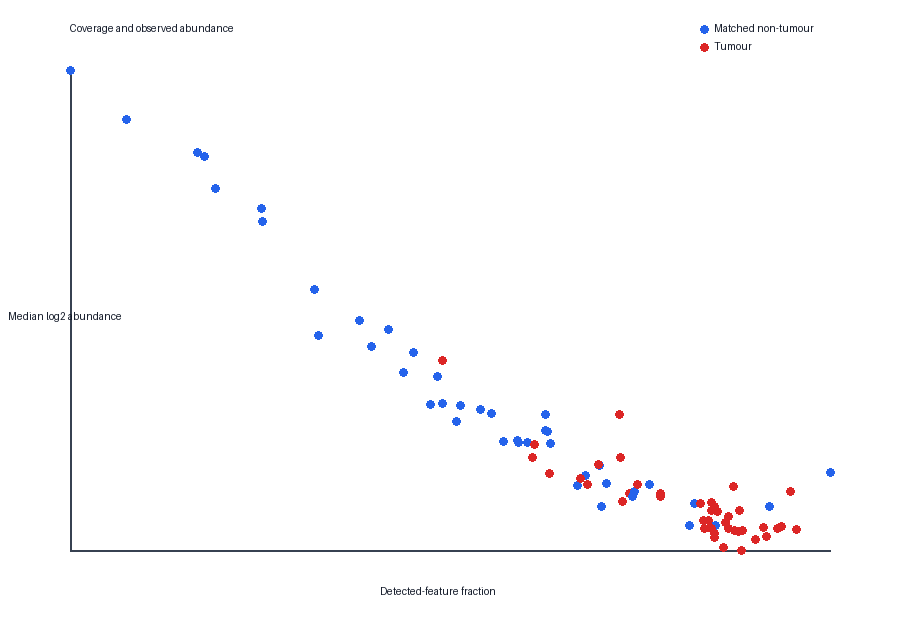

**Figure 1.** Specimen detection coverage versus median observed log2 abundance. The strong inverse association motivates separate abundance and detection analyses.

Missingness decreases from 78.64% in the lowest observed-abundance decile to 4.45% in the highest. Tumour detection fractions exceed matched non-tumour fractions for 5,413 rows; the reverse occurs for 986 rows and equality for 1,672.

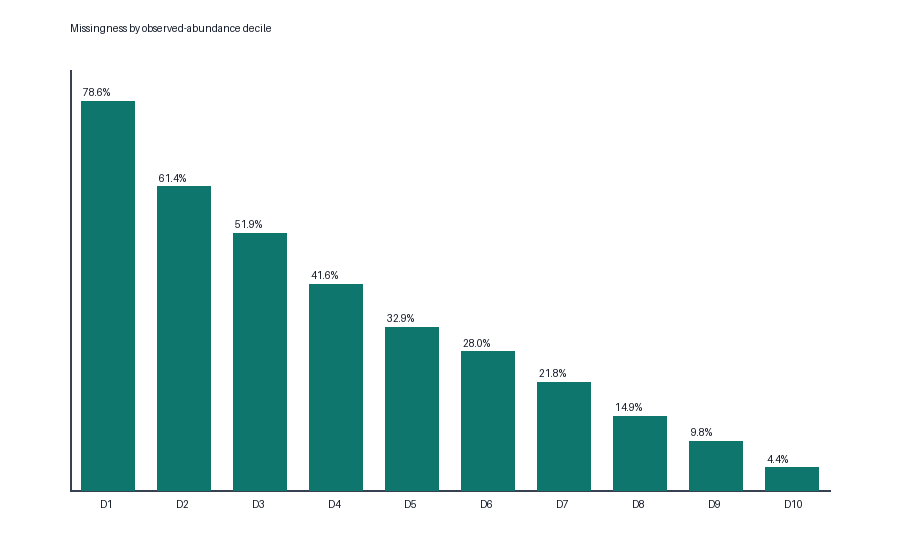

**Figure 2.** Mean missingness across observed-abundance deciles, showing strong abundance dependence.

The median within-pair detection Jaccard similarity is 0.708 (range 0.371–0.880), the median pairwise Spearman correlation is 0.745 (range 0.367–0.940), and the median absolute paired log2 difference is 0.734 (range 0.301–1.521).

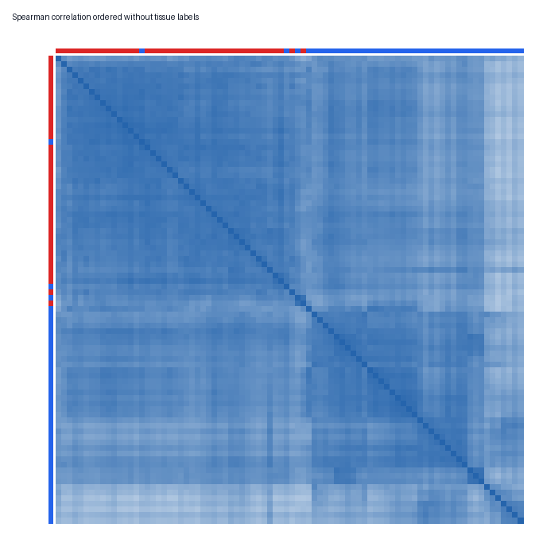

**Figure 3.** Pairwise-complete sample Spearman correlation heatmap with label-blind clustering order.

Diagnostic PCA explains 20.07% on PC1 and 9.89% on PC2; the first five components explain 46.75%. Tissue centroids differ strongly, but batch, purity, inflammation and sampling metadata are unavailable.

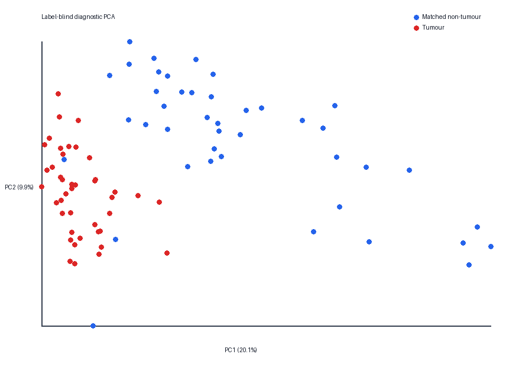

**Figure 4.** Label-blind QC PCA of high-coverage features. Tissue annotations were attached after calculation.

Twelve specimens from seven patients (`P1`, `P2`, `P19`, `P21`, `P25`, `P31`, `P42`) meet the two-family sensitivity flag rule. All 42 pairs remain primary; the frozen sensitivity cohort contains 35 pairs.

## 5.4 Paired feature inference

The primary abundance rule admits 3,430 features. The empirical-Bayes variance prior has 3.776 prior degrees of freedom and scale 0.718. At BH q≤0.05, 2,194 features have quantitative evidence: 986 positive and 1,208 negative. Adding the effect, direction and support thresholds yields 669 primary core features. Cross-scenario stability and identifier requirements leave 614 `B_abundance` candidates: 128 positive and 486 negative.

Examples include PRELP (mean log2 difference −5.346; moderated 95% interval −6.052 to −4.640) and SERPINH1 (2.425; interval 2.091–2.760). Other precise candidates include OGN, SLC3A2, HSPH1, ALDH9A1, EPHX1, PEBP1, SOD3 and DDAH2.

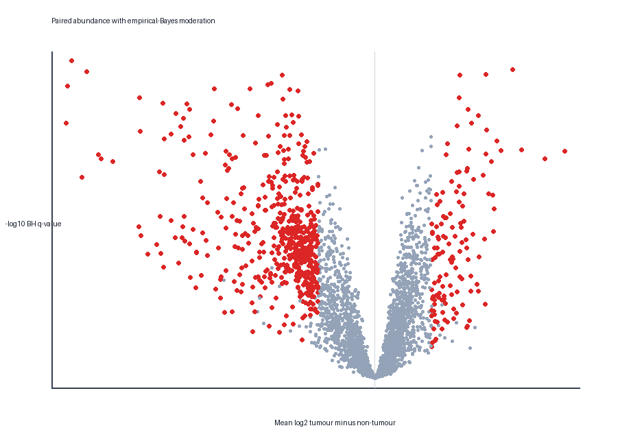

**Figure 5.** Paired abundance effects and BH-adjusted evidence. Highlighting follows the frozen abundance-core rule.

For detection, 2,887 rows have BH q≤0.05; 2,549 meet the primary effect and discordance rule; and 1,831 remain stable in the unflagged cohort. Among these stable patterns, 1,695 favour tumour detection and 136 favour matched non-tumour detection. After excluding ambiguous identifiers, 1,827 rows receive `C_detection_pattern`. Leading tumour-detection labels include SLC38A2, NEDD1, KPNA7, NCAPG, NOMO1, HMGA2, WDR75, SLC38A5, POP4 and SLC39A14.

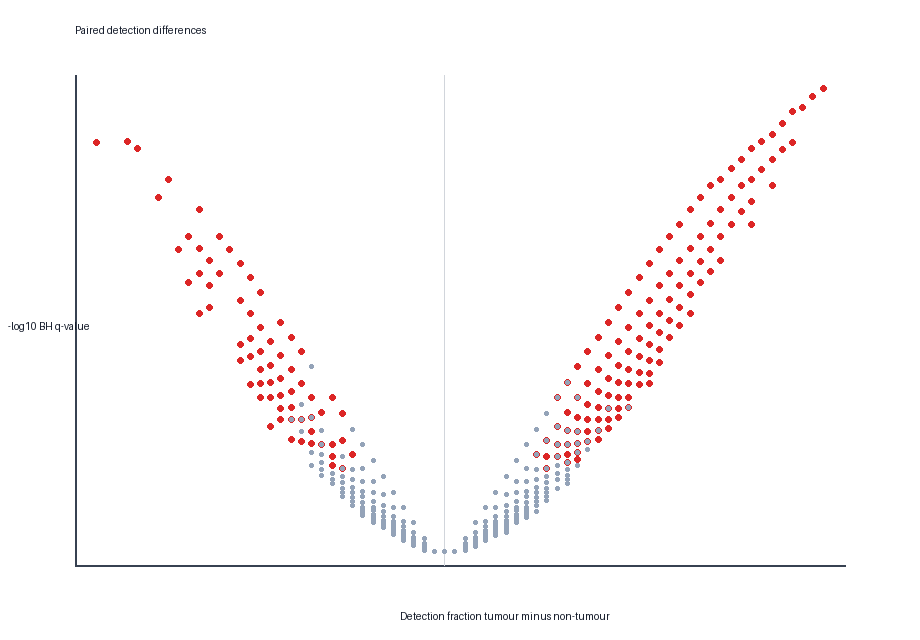

**Figure 6.** Paired detection-fraction differences and BH-adjusted exact-test evidence.

No feature meets the strict `A_concordant` rule. This is structurally plausible because quantitative eligibility requires many both-observed pairs, whereas strong detection evidence requires many discordant pairs. The branches are complementary rather than failed replicas of one another.

## 5.5 Pathway organisation

The ranked view tests 783 pathways, with 328 passing BH q≤0.05. The patient-score view tests 749 pathways, with 566 passing. There are 271 pathways supported by both views with consistent direction.

Positive organisation includes capped-intron pre-mRNA processing (NES 3.297; ranked q=0.00559; paired mean score 0.831; score q=0.000161), mRNA splicing (NES 3.261; mean score 0.865), translation (NES 2.253; mean score 0.438), antigen processing–cross presentation (NES 2.151; mean score 0.352) and cytokine signalling (NES 2.236; mean score 0.257).

Negative organisation includes citric-acid-cycle/respiratory-electron transport (NES −2.835; mean score −1.165), respiratory electron transport (NES −2.869; mean score −1.242), collagen degradation (NES −2.082; mean score −0.723), extracellular-matrix degradation (NES −1.974; mean score −0.629), complement cascade (NES −2.129; mean score −0.550) and haemostasis (NES −1.440; mean score −0.323).

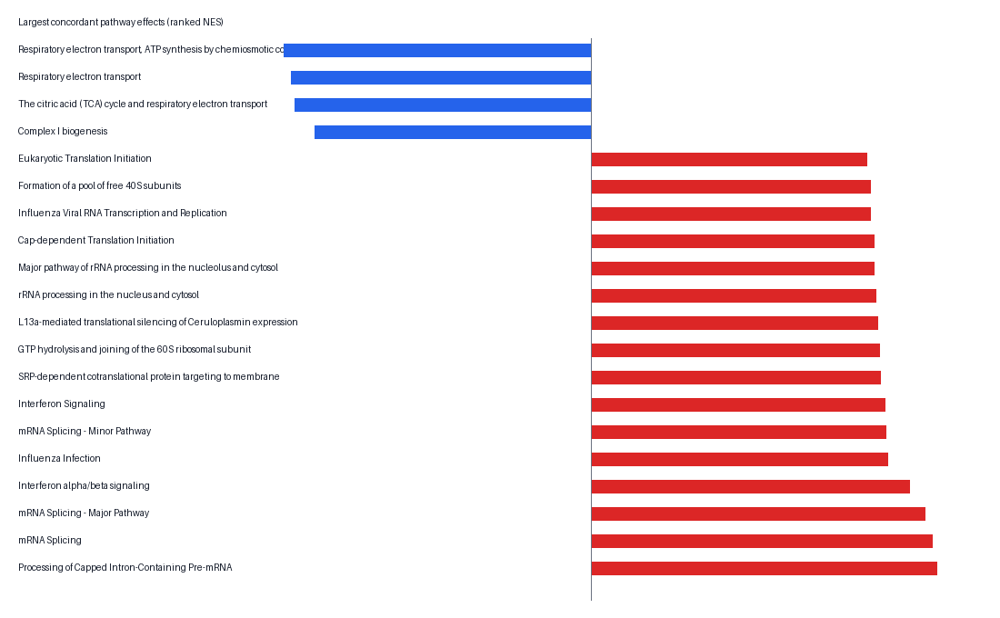

**Figure 7.** Largest concordant ranked pathway effects. Pathway names organise measured proteins and do not prove pathway activation or causality.

## 5.6 Patient heterogeneity

Among 1,350 complete paired-difference features, 500 variable rows entered robust PCA. PC1 explains 41.41% (bootstrap median 42.20%, interval 29.83–52.42%) and PC2 16.13% (median 17.42%, interval 11.72–24.25%). Four components explain 70.72%. Large PC1 loadings include mitochondrial and metabolic proteins such as CYC1, UQCRB, NDUFV1, NDUFS3, SDHB, OGDH and DLD.

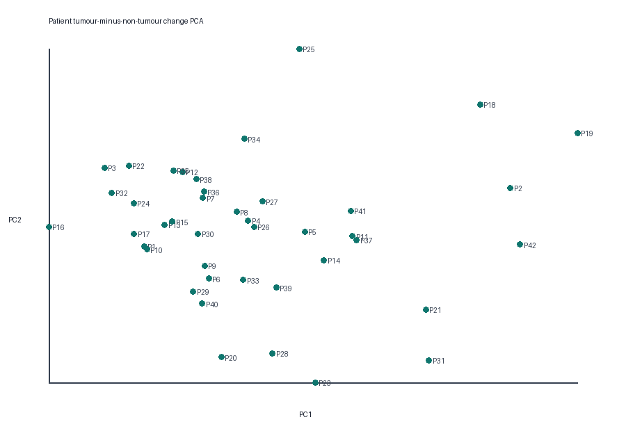

**Figure 8.** PCA of patient-level tumour-minus-non-tumour change profiles.

No consensus-clustering solution passes all frozen criteria. The least ambiguous exploratory `k=2` solution contains 12 and 30 patients, with PAC 0.261, mean within-cluster consensus 0.934 and silhouette 0.372. Because PAC exceeds 0.10, no clinical or molecular subtype is accepted.

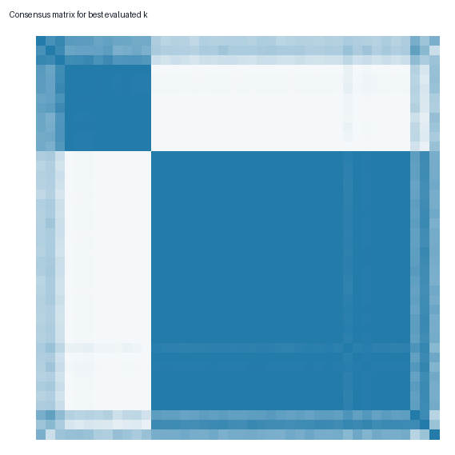

**Figure 9.** Consensus matrix for the best exploratory `k`; it remains unstable under the prespecified PAC criterion.

## 5.7 Machine-learning performance

Across 25 repeated nested partitions, the main results are:

| Pipeline | Median ROC AUC | Median balanced accuracy | Interpretation |
| --- | ---: | ---: | --- |
| Abundance elastic net | 0.982 | 0.964 | Highest median AUC; dense model |
| Abundance linear SVM | 0.980 | 0.964 | Similar performance |
| Combined elastic net | 0.974 | 0.952 | No improvement over abundance |
| Combined linear SVM | 0.974 | 0.952 | No improvement over abundance |
| Detection elastic net | 0.954 | 0.940 | Strong but lower discrimination |
| Detection linear SVM | 0.960 | 0.940 | Strong detection view |
| Fold-local PCA logistic | 0.969 | 0.940 | Close low-dimensional baseline |
| Coverage logistic | 0.868 | 0.786 | Coverage contains substantial signal |
| Intercept null | 0.500 | 0.500 | Chance baseline |

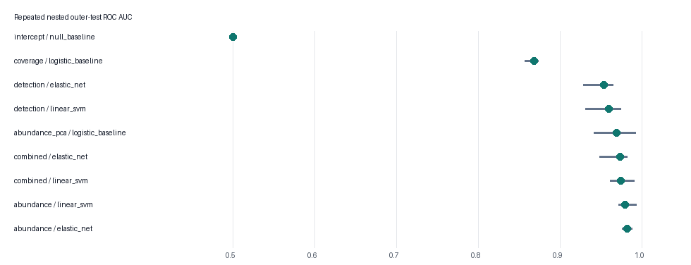

**Figure 10.** Outer-test ROC AUC distributions from repeated patient-grouped nested validation.

The abundance elastic-net median sensitivity is 0.976 and specificity 0.952. However, median calibration intercept is −0.406 and slope 3.53, showing that probability calibration is not transportable. The fold-local PCA baseline has better Brier behaviour and only modestly lower discrimination, so the high-dimensional model does not represent a wholly distinct predictive capability.

The observed paired-label permutation AUC is 0.9768. Across 200 complete nested null reruns, the median is approximately 0.4786 and maximum 0.7319, producing empirical p=(1+0)/(200+1)=0.004975.

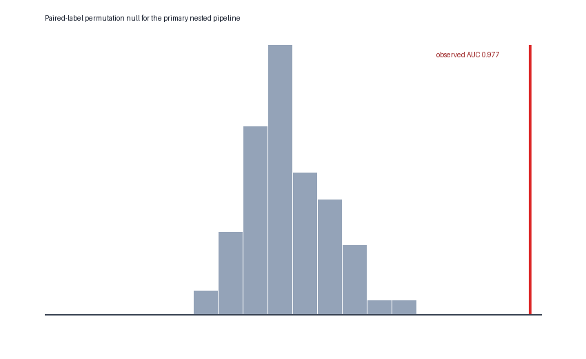

**Figure 11.** Full nested paired-label permutation null for the frozen combined elastic-net pipeline.

The tuned elastic nets have median selected size 97 and favour L1 ratio 0.1, behaving largely as grouped/ridge-like models. Phase 5 therefore does not declare a compact panel. There are 222 stable elastic-net view-feature rows, representing 148 unique modality-qualified features; only 70 have positive mean held-out permutation importance. Frequently recurrent rows include SERPINH1, PRELP, HSPH1, NEDD1, GNA11, MAOB, COLGALT1, OGN, SPTAN1, SLC3A2, NOMO1 and SLC38A2.

## 5.8 Phase 6 robustness

Across 8,071 source rows, 3,077 have complete effect-sign agreement wherever eligible, 1,757 receive FDR support in at least 80% of eligible scenarios, and 368 meet the full core rule in at least 80%. Core counts vary from approximately 319 under the strict uncentred/unflagged/35-pair scenario to approximately 1,050 under median-centred/all-pair/20-pair scenarios. This demonstrates real sensitivity to analysis choice.

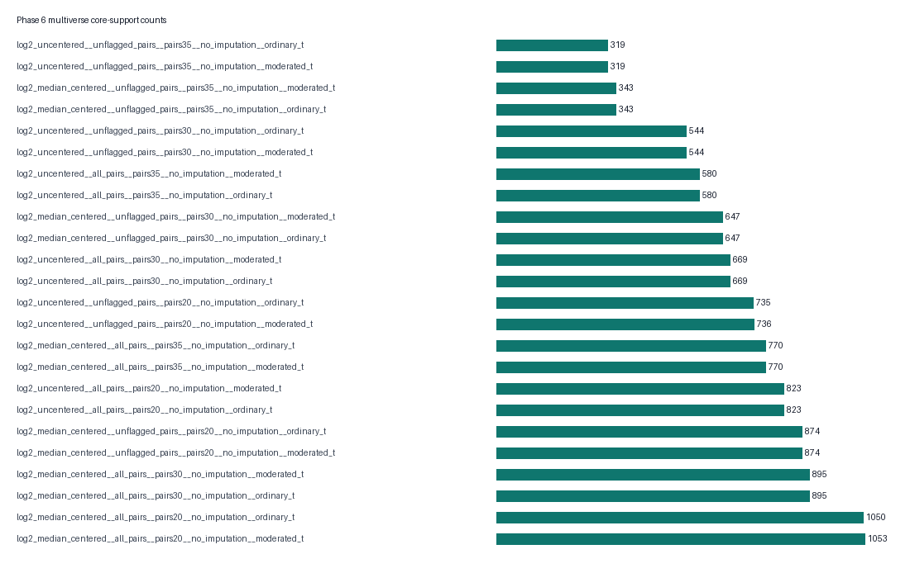

**Figure 12.** Core feature counts across the 24 prespecified multiverse scenarios.

Exact leave-one-patient-out inference shows that 583/614 abundance candidates and 1,804/1,827 detection candidates retain core support in at least 80% of omissions. None of the 614 abundance candidates reverses effect direction. Exact grouped leave-one-patient-out abundance elastic net yields AUC 0.9847, balanced accuracy 0.9643 and correct orientation for 41/42 pairs.

Of 783 pathways, 596 meet direction agreement ≥80% and median leading-edge Jaccard ≥0.30; 563 preserve identical direction across every scenario. The observed overlap between Phase 3 tiered candidates and stable Phase 5 ML features is 140. In 1,000 random feature-key permutations, the median is 45 and maximum 64, giving empirical p=0.000999. This indicates non-random convergence within the dataset, not independent replication.

Frozen integration classifies 165 rows as `high_priority_internal`, 1,909 as `robust_single_domain`, 28 as `predictive_stability_only` and 5,969 as `not_prioritized`. The high-priority group contains 107 abundance and 58 detection candidates.

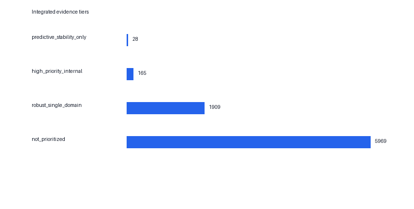

**Figure 13.** Counts under the frozen integrated evidence rules.

## 5.9 Phase 7 validation-readiness package

The 107 abundance candidates form 66 correlation components at absolute Spearman rho ≥0.80 with at least 25 complete pairs. There are 58 singleton components, four size-two components, two size-three components, one size-four component and one size-31 component. This large component illustrates extensive predictor redundancy.

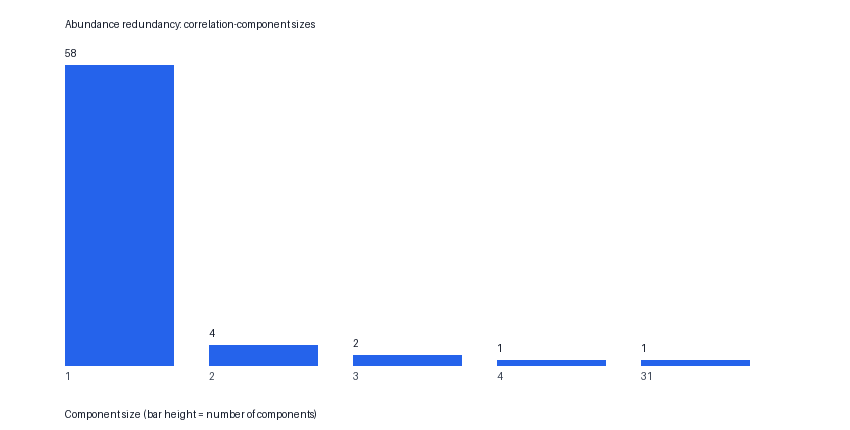

**Figure 14.** Distribution of abundance correlation-component sizes.

The abundance branch contains 14 Pareto fronts, with ten candidates on front 1. The detection branch contains ten fronts, with two candidates on front 1.


**Figure 15.** Candidate counts by branch-specific nondominated Pareto front.

The locked hand-off contains:

| Role | Source labels |
| --- | --- |
| Quantitative-abundance replication anchors | PRELP, CMA1, MGLL, SERPINH1, SOD3, TNXB, KRT4, NDRG2, TNC, OGN, PEBP1, MAOB |
| Detection-mechanism sentinels | NEDD1, SLC38A2, KPNA7, NCAPG, HMGA2, NOMO1, WDR75, POP4 |

For the 12 abundance targets and Bonferroni planning alpha 0.004167, an assumed standardised paired effect of 0.50 requires 60 complete pairs at 80% power or 73 at 90%; an effect of 0.30 requires 157 or 196 pairs. These values demonstrate how strongly planning depends on the assumed replication effect. Detection planning varies additionally with total discordance; for an absolute difference of 0.20 at 80% power, approximate requirements range from 61 pairs at discordance 0.20 to 189 at discordance 0.60.

# 6. Integrated discussion

## 6.1 Strength and nature of the tumour-associated signal

The tumour/non-tumour contrast is strong by several measures: coverage, diagnostic PCA, thousands of multiplicity-controlled feature results, hundreds of concordant pathways and high nested classification AUC. Crucially, the signal also survives exact patient deletion, paired-label permutation and multiple analytical scenarios. It is therefore unlikely to be explained by one patient or random label assignment.

Strength does not imply specificity. Tumour tissues have broader detection coverage but lower median observed abundance, and a coverage-only model reaches AUC 0.868. This means part of the predictive signal is tied to global measurement availability. The abundance PCA baseline also approaches the high-dimensional models. The most defensible interpretation is a broad tissue-state difference combining biology, cellular composition and measurement structure.

## 6.2 Abundance and detection are complementary

The absence of strict concordant A-tier features is informative. Quantitative testing requires many both-observed pairs; detection testing requires discordance. Merging these branches would either discard sparse but stable detection patterns or force imputed values into quantitative inference. Maintaining separate evidence tiers respects the data-generating ambiguity and avoids treating absence of measurement as a numerical concentration.

The strong tumour-favouring detection asymmetry may include genuine tumour-associated detectability, but tumour specimens also have higher global coverage. Without raw files, run order, acquisition parameters or feature-level detection probabilities, feature-specific detection effects cannot be separated completely from global tissue-correlated measurement behaviour.

## 6.3 Biological interpretation

RNA processing, splicing, translation and immune/antigen-handling enrichment on the positive side are compatible with active biosynthetic and host-response organisation in tumour tissue. Negative mitochondrial respiration, extracellular-matrix, complement and haemostasis signatures suggest altered metabolic and tissue-composition organisation. However, pathway scoring measures coordinated abundance in mixed tissue extracts. It does not measure flux, cell-specific activation or causal regulation.

The negative extracellular and plasma-associated signals may reflect stromal, vascular or extracellular content in matched non-tumour tissue, altered tumour composition, or sampling differences. Similarly, viral-disease-labelled Reactome sets can appear because they share interferon or host machinery and must not be interpreted as evidence of viral infection or HPV status.

## 6.4 Heterogeneity without subtypes

Patient-change PCA shows structured heterogeneity, particularly along mitochondrial/metabolic axes, but no cluster solution satisfies stability requirements. Reporting a `k=2` visual partition as a subtype would turn an exploratory geometry into a categorical clinical claim. The correct negative result is that stable patient response subtypes were not established in 42 patients under the declared procedure.

## 6.5 Predictive performance and AI contribution

The AI contribution is methodological rather than promotional. The project demonstrates that complex and simple models can be compared under identical grouped nested validation; that coverage and PCA baselines are essential; that preprocessing and selection must be fold-local; and that a full nested permutation null provides stronger evidence than comparing one observed score with 0.5.

The leading model's high AUC is credible as internal tissue-state separation, but not as clinical diagnosis. There are no healthy participants, benign lesions, inflammatory controls, premalignant lesions, other cancers, prospective samples or independent laboratories. Both samples from each patient are surgically paired tissues. Furthermore, dense elastic-net fits and correlated substitutes prevent a compact mechanistic-panel interpretation.

## 6.6 Robustness and prioritisation

The multiverse shows both stability and choice sensitivity. Many signs are stable, but core-list size changes materially under normalisation, cohort and support thresholds. Patient-deletion results show that most tiered findings are not driven by one individual, while the pathway leading-edge criterion prevents a stable pathway name from hiding unstable supporting proteins.

The 165 high-priority rows are a transparent follow-up queue, not a posterior probability of biomarker validity. Phase 7 further reduces redundancy without creating a weighted score. The 20 locked targets balance branch-specific evidence and future measurement roles. Their validation state remains `not_executed`.

## 6.7 What is genuinely new

The work's originality lies in the integrated analytical architecture:

- simultaneous preservation of quantitative and detection estimands;
- a patient-paired empirical-Bayes inference branch with explicit sensitivity cohorts;
- two-view pathway evidence and leading-edge traceability;
- strict refusal to call unstable clusters subtypes;
- repeated nested patient-grouped AI with leakage failure tests and complete permutation reruns;
- a 24-scenario inference/pathway multiverse and exact patient influence analysis;
- a limitations-aware feature evidence table rather than a decontextualised protein list; and
- a Pareto- and redundancy-based prospective hand-off that avoids reusing discovery performance as validation.

# 7. Assumptions, limitations and prohibited claims

## 7.1 Operational assumptions

| ID | Working assumption | Basis | Confidence and safeguard |
| --- | --- | --- | --- |
| A01 | `P<number>N/T` identifies one matched patient pair | Consistent naming and source report | High; exact one-N/one-T rule and grouped resampling |
| A02 | Positive values are not conventional log2 values | Range 0.002342–7.311 billion | High; observed values transformed with log2 only |
| A03 | Blanks are missing/unreported, not measured zero | Workbook representation | Mechanism uncertain; never zero-filled; detection analysed separately |
| A04 | Source row is the safest feature unit | Protein-group terminology and absent accessions | High; stable keys; no silent splitting or averaging |
| A05 | Patient is the independent biological unit | Matched design | Verified; paired inference and patient-grouped resampling |
| A06 | Uncentred and median-centred log2 are plausible views | Unknown upstream normalisation | Moderate; compared in sensitivity analysis |
| A07 | No-imputation abundance is the primary inference | Unknown missingness mechanism and literature | Moderate-high; detection separated; Phase 2 remains required |
| A08 | Literature may justify methods but not fill project facts | Data-only scope | High; external knowledge restricted to methods and pathways |

## 7.2 Limitation register

| ID | Missing information or constraint | Consequence | Mitigation | Claims still prohibited |
| --- | --- | --- | --- | --- |
| L01 | Raw spectra and complete quantitative export | Identification, interference and instrument QC cannot be repeated | Preserve matrix, statistical QC, stable-feature emphasis | Raw-data reprocessing validation |
| L02 | Instrument, acquisition, Spectronaut version, quantity definition and upstream normalisation | Exact scale generation is uncertain | Restrained representations and multiverse | Exact DIA/acquisition claims |
| L03 | Search database, peptide evidence, accessions, protein inference and identification FDR | Gene labels do not prove individual proteins/isoforms | Preserve rows and ambiguity flags | Isoform-specific claims or reconstructed ID FDR |
| L04 | Batch, run order, preparation batch and controls | Technical structure cannot be assigned or corrected | Latent diagnostics and sensitivity analysis | Proof of batch-free data or batch-adjusted causality |
| L05 | Site, histology, stage, grade, HPV, purity, inflammation, exposures and treatment | Clinical confounding and heterogeneity cannot be modelled | Broad labels and paired tissue estimand | Stage/HPV/subsite/exposure conclusions |
| L06 | Distance and pathology of non-tumour specimens | Comparison tissue may contain field effects or inflammation | Use “matched non-tumour” | Healthy-control or cancer-free-population claims |
| L07 | Cause of each missing value | Low abundance and technical filtering cannot be separated | Missingness preserved; detection analysed separately | Blank equals zero or biological absence |
| L08 | Independent cohort and orthogonal assay | Generalisability and assay transfer unproven | Nested validation, permutation, robustness and locked protocol | Externally validated biomarker or clinical panel |
| L09 | Outcomes and intended-use population | Prognosis, response and screening cannot be studied | No surrogate outcomes | Survival, recurrence, treatment response or screening |
| L10 | Ethics, consent, controller and sharing permissions | Public/cross-border sharing not authorised from analysis files | Keep data local and pseudonymous | GDPR/EHDS compliance or unrestricted release |
| L11 | Only 42 independent patients | High-dimensional estimates remain unstable | Pairing, moderation, shrinkage, grouped nesting and influence analysis | Clinical-grade performance or fine subtypes |
| L12 | No healthy, benign, premalignant or asymptomatic groups | Cancer specificity and early detection unmeasured | Tissue-state interpretation only | Screening, early diagnosis or differential diagnosis |

## 7.3 Additional analytical limitations

Phase 2 is missing, so the thesis cannot claim that findings are invariant to mechanism-aware imputation or missing-aware PCA choices. The empirical-Bayes implementation uses a transparent moment estimator rather than the complete limma software stack. Pathway permutations and Reactome mappings inherit gene-set overlap and database incompleteness. Model performance intervals across repeated folds are resampling distributions over the same patients, not independent-cohort confidence intervals. Pareto fronts depend on the declared objectives and shortlist capacity. Correlation components are sensitive to threshold and can combine features through transitive paths.

## 7.4 Explicitly prohibited conclusions

This thesis does not establish:

- an externally validated biomarker or protein panel;
- a clinical diagnostic, screening, prognostic or treatment-response test;
- oral-cancer specificity or early-disease sensitivity;
- causal pathway activation or inhibition;
- molecular or clinical patient subtypes;
- individual risk probabilities;
- platform-independent quantitative concentrations;
- a CE-mark-ready or IVDR-conforming device; or
- permission for public release of patient-level data.

# 8. European and translational alignment

European-facing terminology requires exact anatomical and pathology evidence before using labels such as oral cavity squamous cell carcinoma, HNSCC or HPV-related disease. These fields are unavailable, so the broad oral-cancer label is retained. Matched non-tumour is not called healthy or normal.

For future translation, Regulation (EU) 2017/746 distinguishes scientific validity, analytical performance and clinical performance for an intended purpose. This discovery matrix contributes exploratory scientific evidence only. A future assay would require locked analytes, measurement procedures, detection limits, precision, interference assessment, reference standards where possible, intended-use participants and independent clinical performance evidence. Phase 7's protocol is preparatory, not a conformity assessment.

BRISQ supports complete reporting of biospecimen collection, processing and storage (Moore et al., 2011). MIAPE supports proteomics acquisition and processing metadata (Taylor et al., 2007). Both reveal gaps rather than certify the present data. Ethics approval, consent scope, lawful basis, data-controller roles and permitted secondary use must be recovered before sharing; pseudonymised health and molecular data should not be assumed anonymous.

TRIPOD and PROBAST shape prediction reporting and risk-of-bias interpretation (Collins et al., 2015; Wolff et al., 2019). Under PROBAST reasoning, the single small cohort, discovery-only participants, incomplete clinical metadata and absent external validation create high applicability concern despite strong internal discrimination.

# 9. Reproducibility, software and auditability

## 9.1 Repository organisation

The repository separates:

- `config/`: frozen analytical thresholds and grids;
- `data/interim/`: regenerable matrices and manifests;
- `src/oral_cancer/`: reusable statistical, pathway, ML, robustness and readiness modules;
- `scripts/`: numbered phase entry points;
- `tests/`: method contracts, leakage failure tests and output checks;
- `results/phase*/`: tables, figures, validations and manifests; and
- `records/`: implementation and decision histories.

## 9.2 Environment

The completed Phase 6–7 environment records Python 3.12.14, NumPy 2.3.5, pandas 3.0.1, SciPy 1.18.1 and scikit-learn 1.7.2 on Windows 11. Random seeds, Reactome release/checksum, source hash, configuration files and output SHA-256 hashes are recorded.

## 9.3 Automated checks

The final Phase 0–7 suite contains 35 passing tests. These cover sample parsing, exact pairing, matrix orientation, tumour-minus-non-tumour sign, missing-data preservation, cohort pairing, multiple-testing functions, pathway resource/version checks, patient scoring, leakage failure states, outer-test prediction completeness, multiverse dimensions, leave-one-patient-out pairing, claim scopes, Pareto dominance, power monotonicity and shortlist containment.

Phase 6 reproduced 22 compared outputs byte-for-byte in the pinned local environment. Phase 7 reproduced 11 core outputs exactly. The full clean-environment, workbook-to-final-output rebuild remains open, so M6 is not described as fully closed.

## 9.4 Regeneration commands

```powershell
python scripts/run_phase0.py
python scripts/run_phase1.py
python scripts/run_phase3.py
python scripts/run_phase4.py
python scripts/run_phase5.py
python scripts/run_phase6.py
python scripts/run_phase7.py
python -m unittest discover -s tests -v
```

Phase 5 is computationally expensive because it runs repeated nested validation and 200 complete permutations. Phase 6 additionally executes 42 nested leave-one-patient-out model fits.

# 10. Conclusions and future work

## 10.1 Conclusions

The supplied proteomics matrix contains a strong, internally reproducible difference between tumour and matched non-tumour tissue. This conclusion is supported by paired abundance, paired detection, pathway organisation, patient-grouped predictive modelling, paired-label permutation, multiverse analysis and exact patient deletion.

The analysis identifies 614 stable abundance candidates, 1,827 stable detection patterns, 271 pathways supported by two internal views, 165 high-priority integrated candidates, and a locked prospective hand-off of 20 targets. It finds no stable patient subtype and no defensible compact predictive panel. The latter negative findings are important because they prevent attractive but unsupported conclusions.

The work demonstrates substantial data-science and AI content while retaining biological and clinical humility. Its main product is not a single classifier or protein list, but a reproducible evidence system that exposes how each claim depends on source rows, analytical choices, patient influence and unresolved limitations.

## 10.2 Immediate computational priority

The immediate priority is to implement Phase 2 exactly as prespecified. It should benchmark missingness and PCA strategies with patient-level artificial masking, paired-effect preservation and stability criteria. After Phase 2, Phases 3–7 should be regenerated without changing frozen thresholds in response to the new results. Differences must be reported as sensitivity evidence.

## 10.3 Required future experimental work

True validation requires new information and therefore lies outside the current data-only scope. A future study should:

1. recruit patients absent from the discovery workbook;
2. define oral site, pathology, intended-use population and reference standard;
3. include appropriate healthy, benign, inflammatory, premalignant or other-cancer groups if diagnostic specificity is claimed;
4. use orthogonal or explicitly validated quantitative assays;
5. record collection, preservation, batch, run order, technical controls and detection limits;
6. blind laboratory processing and adjudication to candidate rank;
7. lock endpoints, candidate membership and multiplicity before outcome inspection;
8. report failed measurements and exclusions; and
9. assess scientific validity, analytical performance and clinical performance separately.

The Phase 7 power grids should be updated with assay-specific variance, discordance and attrition assumptions rather than the selected discovery effects.

# 11. References

Benjamini Y, Hochberg Y. Controlling the false discovery rate: a practical and powerful approach to multiple testing. *Journal of the Royal Statistical Society: Series B*. 1995;57:289–300. [https://doi.org/10.1111/j.2517-6161.1995.tb02031.x](https://doi.org/10.1111/j.2517-6161.1995.tb02031.x)

Chion M, Carapito C, Bertrand F. Accounting for multiple imputation-induced variability for differential analysis in mass spectrometry-based label-free quantitative proteomics. *PLoS Computational Biology*. 2022;18:e1010420. [https://doi.org/10.1371/journal.pcbi.1010420](https://doi.org/10.1371/journal.pcbi.1010420)

Collins GS, Reitsma JB, Altman DG, Moons KGM. Transparent Reporting of a multivariable prediction model for Individual Prognosis Or Diagnosis (TRIPOD). *BMJ*. 2015;350:g7594. [https://doi.org/10.1136/bmj.g7594](https://doi.org/10.1136/bmj.g7594)

Davis SE et al. A framework for understanding label leakage in machine learning for health care. *Journal of the American Medical Informatics Association*. 2023;31:274–280. [https://doi.org/10.1093/jamia/ocad178](https://doi.org/10.1093/jamia/ocad178)

European Parliament and Council. Regulation (EU) 2017/746 on in vitro diagnostic medical devices. 2017. [https://eur-lex.europa.eu/eli/reg/2017/746/oj](https://eur-lex.europa.eu/eli/reg/2017/746/oj)

Gillespie M et al. The Reactome pathway knowledgebase 2022. *Nucleic Acids Research*. 2022;50:D687–D692. [https://doi.org/10.1093/nar/gkab1028](https://doi.org/10.1093/nar/gkab1028)

Goeminne LJE et al. Experimental design and data-analysis in label-free quantitative LC/MS proteomics: a tutorial with MSqRob. *Journal of Proteomics*. 2018;171:23–36. [https://doi.org/10.1016/j.jprot.2017.04.004](https://doi.org/10.1016/j.jprot.2017.04.004)

Jin L et al. Systematic evaluation of imputation methods for the analysis of mass spectrometry-based label-free quantitative proteomics data. *Briefings in Bioinformatics*. 2021. [https://pubmed.ncbi.nlm.nih.gov/33469060/](https://pubmed.ncbi.nlm.nih.gov/33469060/)

Kapoor S, Narayanan A. Leakage and the reproducibility crisis in machine-learning-based science. *Patterns*. 2023;4:100804. [https://doi.org/10.1016/j.patter.2023.100804](https://doi.org/10.1016/j.patter.2023.100804)

Khatri P, Sirota M, Butte AJ. Ten years of pathway analysis: current approaches and outstanding challenges. *Nature Reviews Genetics*. 2012;13:572–586. [https://doi.org/10.1038/nrg3175](https://doi.org/10.1038/nrg3175)

Lazar C et al. Accounting for the multiple natures of missing values in label-free quantitative proteomics data sets to compare imputation strategies. *Journal of Proteome Research*. 2016;15:1116–1125. [https://doi.org/10.1021/acs.jproteome.5b00981](https://doi.org/10.1021/acs.jproteome.5b00981)

Lewis JE et al. nestedcv: nested cross-validation with embedded feature selection for high-dimensional data. *Bioinformatics Advances*. 2023;3:vbad048. [https://pubmed.ncbi.nlm.nih.gov/37113250/](https://pubmed.ncbi.nlm.nih.gov/37113250/)

Li M, Smyth GK. Neither random nor censored: estimating intensity-dependent probabilities for missing values in label-free proteomics. *Bioinformatics*. 2023;39(5):btad200. [https://doi.org/10.1093/bioinformatics/btad200](https://doi.org/10.1093/bioinformatics/btad200)

Meinshausen N, Bühlmann P. Stability selection. *Journal of the Royal Statistical Society: Series B*. 2010;72:417–473. [https://doi.org/10.1111/j.1467-9868.2010.00740.x](https://doi.org/10.1111/j.1467-9868.2010.00740.x)

Monti S et al. Consensus clustering: a resampling-based method for class discovery and visualization of gene expression microarray data. *Machine Learning*. 2003;52:91–118. [https://doi.org/10.1023/A:1023949509487](https://doi.org/10.1023/A:1023949509487)

Moore HM et al. Biospecimen reporting for improved study quality (BRISQ). *Cancer Cytopathology*. 2011;119:92–102. [https://doi.org/10.1002/cncy.20147](https://doi.org/10.1002/cncy.20147)

O'Brien JJ et al. The effects of nonignorable missing data on label-free mass spectrometry proteomics experiments. *Annals of Applied Statistics*. 2018;12:2075–2095. [https://doi.org/10.1214/18-AOAS1144](https://doi.org/10.1214/18-AOAS1144)

Ritchie ME et al. limma powers differential expression analyses for RNA-sequencing and microarray studies. *Nucleic Acids Research*. 2015;43:e47. [https://doi.org/10.1093/nar/gkv007](https://doi.org/10.1093/nar/gkv007)

Şenbabaoğlu Y, Michailidis G, Li JZ. Critical limitations of consensus clustering in class discovery. *Scientific Reports*. 2014;4:6207. [https://doi.org/10.1038/srep06207](https://doi.org/10.1038/srep06207)

Smyth GK. Linear models and empirical Bayes methods for assessing differential expression in microarray experiments. *Statistical Applications in Genetics and Molecular Biology*. 2004;3. [https://doi.org/10.2202/1544-6115.1027](https://doi.org/10.2202/1544-6115.1027)

Stacklies W et al. pcaMethods—a Bioconductor package providing PCA methods for incomplete data. *Bioinformatics*. 2007;23:1164–1167. [https://doi.org/10.1093/bioinformatics/btm069](https://doi.org/10.1093/bioinformatics/btm069)

Steegen S et al. Increasing transparency through a multiverse analysis. *Perspectives on Psychological Science*. 2016;11:702–712. [https://doi.org/10.1177/1745691616658637](https://doi.org/10.1177/1745691616658637)

Subramanian A et al. Gene set enrichment analysis: a knowledge-based approach for interpreting genome-wide expression profiles. *Proceedings of the National Academy of Sciences*. 2005;102:15545–15550. [https://doi.org/10.1073/pnas.0506580102](https://doi.org/10.1073/pnas.0506580102)

Taylor CF et al. The minimum information about a proteomics experiment (MIAPE). *Nature Biotechnology*. 2007;25:887–893. [https://doi.org/10.1038/nbt1329](https://doi.org/10.1038/nbt1329)

Varma S, Simon R. Bias in error estimation when using cross-validation for model selection. *BMC Bioinformatics*. 2006;7:91. [https://doi.org/10.1186/1471-2105-7-91](https://doi.org/10.1186/1471-2105-7-91)

Webb-Robertson B-JM et al. Review, evaluation, and discussion of missing-value imputation for label-free global proteomics. *Journal of Proteome Research*. 2015;14:1993–2001. [https://doi.org/10.1021/pr501138h](https://doi.org/10.1021/pr501138h)

Wilkinson MD et al. The FAIR Guiding Principles for scientific data management and stewardship. *Scientific Data*. 2016;3:160018. [https://doi.org/10.1038/sdata.2016.18](https://doi.org/10.1038/sdata.2016.18)

Wolff RF et al. PROBAST: a tool to assess risk of bias and applicability of prediction model studies. *Annals of Internal Medicine*. 2019;170:51–58. [https://doi.org/10.7326/M18-1376](https://doi.org/10.7326/M18-1376)

Zou H, Hastie T. Regularization and variable selection via the elastic net. *Journal of the Royal Statistical Society: Series B*. 2005;67:301–320. [https://doi.org/10.1111/j.1467-9868.2005.00503.x](https://doi.org/10.1111/j.1467-9868.2005.00503.x)

# 12. Appendices

## Appendix A. Principal result artifacts

| Artifact | Purpose |
| --- | --- |
| `data/interim/sample_manifest.csv` | Immutable specimen/patient/tissue mapping |
| `data/interim/feature_manifest.csv` | Source-row keys and identifier flags |
| `results/phase1/feature_missingness.csv` | Feature-level observation and detection structure |
| `results/phase3/integrated_candidate_evidence.csv` | All feature-level abundance/detection evidence |
| `results/phase4/integrated_pathway_evidence.csv` | Ranked and paired pathway evidence |
| `results/phase5/outer_test_predictions.csv` | Complete outer-test predictions |
| `results/phase5/stable_exploratory_panel.csv` | Stability catalogue, not a validated panel |
| `results/phase6/integrated_evidence_table.csv` | Full 8,071-row cross-phase evidence table |
| `results/phase6/claim_ledger.csv` | Claims, evidence locators and limitations |
| `results/phase7/candidate_validation_readiness.csv` | Pareto and redundancy-aware readiness evidence |
| `results/phase7/locked_handoff_shortlist.csv` | Frozen prospective follow-up targets |
| `results/phase7/prospective_validation_protocol.json` | Machine-readable future-study safeguards |

## Appendix B. Configuration files

Analytical choices are stored in `config/analysis_contract.yml`, `config/phase1.yml`, `config/phase3.yml`, `config/phase4.yml`, `config/phase5.yml`, `config/phase6.yml` and `config/phase7.yml`. These files should be archived with any thesis submission so thresholds can be distinguished from results copied into prose.

## Appendix C. Reporting status

This Markdown document is the source thesis manuscript. Candidate name, institution, programme and supervisor remain placeholders. Formatting required by a university—cover page, declaration, acknowledgements, pagination, heading numbering and citation style—should be applied when converting this source to Word, LaTeX or PDF. Numerical results should continue to be generated from saved machine-readable outputs rather than manually edited in the manuscript.

## Appendix D. Frozen configuration summary

| Phase | Frozen settings central to interpretation |
| --- | --- |
| 1 | QC observation threshold 80%; robust-z clipping ±5; specimen flag threshold 3.5 within tissue; at least two diagnostic families; 128 robust-covariance starts; seed 20231031 |
| 3 | Primary complete-pair minimum 30; sensitivity minima 20 and 35; abundance and detection FDR 0.05; abundance effect ≥1 log2; direction consistency ≥0.70; detection difference ≥0.20; at least ten discordant pairs |
| 4 | Reactome release 86; pathway sizes 10–300; 1,000 ranked permutations; 20,000 patient sign flips; FDR 0.05; 500 heterogeneity features; 200 PCA bootstraps; consensus `k=2–5`; 200 80%-patient resamples |
| 5 | 25 outer repeats; six outer and five inner grouped folds; `C` grid 0.0001–100; elastic-net L1 ratios 0.1, 0.5, 0.9, 1.0; SVM candidate counts 25, 50, 100; 200 paired-label permutations; stable selection ≥0.60; sign consistency ≥0.80; seed 20231117 |
| 6 | 24 scenarios; integration thresholds: sign ≥0.90, multiverse core ≥0.80, LOPO retention ≥0.80, ML selection ≥0.60; pathway direction ≥0.80 and median leading-edge Jaccard ≥0.30; 1,000 overlap permutations; seed 20231201 |
| 7 | 12 abundance and eight detection slots; abundance complete pairs ≥35; branch LOPO retention ≥0.90; absolute Spearman threshold 0.80 with ≥25 pairs; familywise alpha 0.05; planning power 0.80/0.90 |
