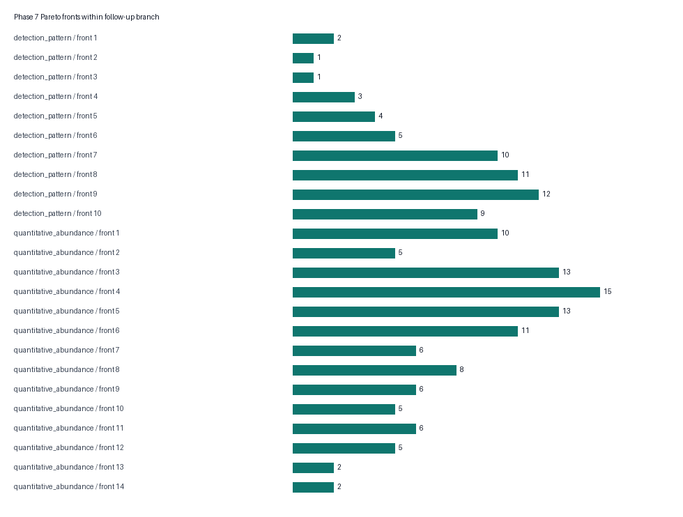

# Phase 7 validation-readiness and locked hand-off results

## Scope of the extension

The original data-only roadmap ended at Phase 6 and named independent validation as future work. Phase 7 has therefore been implemented as a validation-readiness phase, not as validation itself. It converts the Phase 6 evidence package into a frozen, redundancy-aware follow-up design while using no observations beyond the supplied 42 patient pairs. Its outputs answer which internal candidates should be carried forward, which measurements would need to be made, how multiplicity and sample-size assumptions should be declared, and which claims remain unavailable until a genuinely independent study exists.

This distinction is essential in the European context. The EU in-vitro diagnostic framework separates scientific validity, analytical performance and clinical performance, and expects performance evaluation to be tied to a defined intended purpose. The present matrix can contribute exploratory scientific-validity evidence, but it cannot establish analytical or clinical performance for a device ([Regulation (EU) 2017/746, Annex XIII](https://eur-lex.europa.eu/legal-content/EN/ALL/?uri=CELEX%3A32017R0746)). Phase 7 is not a conformity assessment or regulatory submission.

## Candidate decision structure

All 165 `high_priority_internal` Phase 6 rows enter Phase 7. No candidate is added from literature or from a favourable post-hoc search. The 107 quantitative-abundance candidates and 58 detection-pattern candidates are handled in separate branches because they imply different validation measurements and estimands.

Within each branch, nondominated Pareto fronts replace a single weighted score. An abundance candidate is evaluated on absolute paired effect, adjusted-evidence strength, direction consistency, multiverse core support, leave-one-patient-out retention and number of additional evidence dimensions. A detection candidate is evaluated on detection difference, adjusted-evidence strength, sensitivity support, leave-one-patient-out retention and additional evidence dimensions. One candidate dominates another only when it is no worse on every declared dimension and better on at least one. This preserves genuine trade-offs and avoids inventing arbitrary conversion factors between effect size, robustness, pathway evidence and ML stability.

The abundance branch contains 14 Pareto fronts; ten candidates are on its first front. The detection branch contains ten fronts; two candidates are on its first front. These front numbers are decision aids within a branch, not biological ranks and not comparable across branches.

## Redundancy-aware abundance hand-off

The paired tumour-minus-non-tumour change vectors for the 107 abundance candidates were compared with pairwise-complete Spearman correlation, requiring at least 25 patient pairs. Edges were retained at absolute correlation at least 0.80 and connected components were formed deterministically. This produces 66 components and 105 retained edges. Fifty-eight components are singletons; four contain two features, two contain three, one contains four, and one large component contains 31 correlated features.

One representative per component is eligible for the locked abundance hand-off, chosen first by the frozen readiness rule and Pareto front and then by the declared robustness tie-breakers. Correlation is used only to avoid spending scarce follow-up capacity on interchangeable discovery signals. It does not imply shared causality, direct protein interaction or pathway membership.

The 12 locked abundance replication anchors are PRELP, CMA1, MGLL, SERPINH1, SOD3, TNXB, KRT4, NDRG2, TNC, OGN, PEBP1 and MAOB. They are proposed targets for independent quantitative replication, not a diagnostic panel. The large 31-feature correlation component is represented by OGN under the frozen rule; all component members remain in the full readiness table and can be substituted only through an amendment documented before viewing validation outcomes.

## Detection-pattern hand-off

The eight locked detection-mechanism sentinels are NEDD1, SLC38A2, KPNA7, NCAPG, HMGA2, NOMO1, WDR75 and POP4. Their discovery evidence concerns asymmetric observation, not a proven biological on/off state. A future protocol must define the assay, limit of detection, treatment of values below that limit and failure rules before measuring outcomes. Until those conditions are fixed, detection-pattern evidence cannot be translated into a clinical positivity threshold.

The abundance and detection targets are intentionally named differently in the protocol. An abundance anchor asks whether a paired quantitative contrast replicates. A detection sentinel asks whether a prospectively defined measurement process reproduces a discordance pattern and whether that pattern survives inspection of assay failures and limits of detection.

## Prospective sample-size sensitivity

The planning tables avoid using selected discovery effects as if they were unbiased future effects. For 12 abundance targets, a Bonferroni planning alpha of 0.004167 is combined with assumed standardized paired effects of 0.30, 0.50, 0.80 and 1.00. At 80% power the corresponding complete-pair requirements are 157, 60, 26 and 18; at 90% power they are 196, 73, 32 and 22. These are noncentral-t calculations and are sensitivity values, not a recommended enrolment count. Attrition, failed measurements, design effects, subgroup aims and the final multiplicity procedure must be added prospectively.

For eight detection targets, the separate table spans absolute paired detection differences of 0.10–0.30 and total discordant fractions of 0.20–0.60. It uses a two-sided McNemar normal approximation with per-target alpha 0.00625. Requirements vary widely—for example, detecting an absolute difference of 0.20 at 80% power ranges from approximately 61 pairs when total discordance is 0.20 to 189 when total discordance is 0.60. These values must be recalculated with an exact or simulation-based method after the assay and plausible discordance structure are known.

## Locked future-study safeguards

The machine-readable protocol requires patients absent from the discovery workbook, a prespecified intended-use population and reference standard, blinded measurement and adjudication, randomized run order, recorded site/batch/preanalytical variables, locked candidate membership, complete failure reporting and preservation of pairing when the paired-tissue estimand is retained. BRISQ supports explicit biospecimen and preanalytical reporting, while MIAPE motivates complete proteomics-method reporting ([Moore et al., 2011](https://doi.org/10.1002/cncy.20147); [Taylor et al., 2007](https://doi.org/10.1038/nbt1329)).

The protocol also forbids calling a resplit, bootstrap or leave-one-out reuse of the 42 discovery patients “external validation.” Thresholds, candidate membership and assay-processing rules may not be revised after validation outcomes are observed. Screening or diagnostic claims require intended-use controls and an independent clinical population; matched non-tumour tissue alone cannot supply specificity for healthy, benign, inflammatory or premalignant conditions.

## Milestone interpretation

`M7_readiness` passes computationally. All 165 candidates are traceable, the shortlist is unique and contained within the Phase 6 high-priority set, the Pareto procedure uses no weighted composite, redundancy is calculated from paired changes, planning tables are assumption grids, and the protocol says validation was not executed. The package reproduces exactly in the present environment.

The milestone status remains `READINESS_PACKAGE_PASS_VALIDATION_NOT_EXECUTED_PHASE2_PENDING`. Phase 2 is still needed before the discovery pipeline can be considered complete, and an external study is still needed before any validation claim becomes available.

## Primary artifacts

- `candidate_validation_readiness.csv` preserves all 165 candidates, branch-specific evidence and Pareto fronts.
- `abundance_redundancy_components.csv` and `abundance_redundancy_edges.csv` expose the complete correlation reduction.
- `locked_handoff_shortlist.csv` freezes the 12 abundance and eight detection targets.
- `abundance_sample_size_sensitivity.csv` and `detection_sample_size_sensitivity.csv` store prospective assumption grids.
- `prospective_validation_protocol.json` stores the design rules and prohibited reuse.
- `phase7_claim_ledger.csv`, `phase7_validation.json`, `reproducibility_gate.json` and `output_manifest.json` provide the audit layer.

